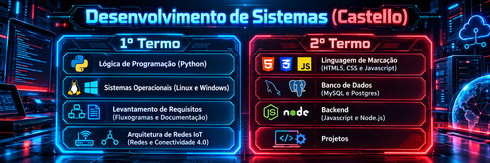

<p align="center">
  
</p>

# 💻 Desenvolvimento de Sistemas — Castello

Repositório acadêmico destinado à organização dos **conteúdos, códigos, atividades, situações de aprendizagem e projetos** desenvolvidos no Curso Técnico em Desenvolvimento de Sistemas.

A proposta é utilizar o GitHub não apenas como espaço de armazenamento, mas como parte do processo de aprendizagem: **versionamento, documentação, organização de projetos e construção de portfólio técnico**.

---

## 🗺️ Trilha de aprendizagem

| Termo | Unidade Curricular | Principais conteúdos |
|---|---|---|
| **1º Termo** | 🐍 Lógica de Programação | Python, algoritmos, estruturas condicionais, repetições, funções e resolução de problemas |
| **1º Termo** | 🖥️ Sistemas Operacionais | Linux, Windows, terminal, arquivos, processos e administração básica |
| **1º Termo** | 📋 Levantamento de Requisitos | Fluxogramas, documentação, requisitos funcionais e não funcionais, modelagem de processos |
| **1º Termo** | 🌐 Arquitetura de Redes e IoT | Redes, protocolos, conectividade, IoT e princípios da Indústria 4.0 |
| **2º Termo** | 🧱 Linguagem de Marcação | HTML5, CSS3, JavaScript e construção de interfaces Web |
| **2º Termo** | 🗄️ Banco de Dados | Modelagem, SQL, MySQL e PostgreSQL |
| **2º Termo** | ⚙️ Backend | JavaScript, Node.js, APIs e integração com banco de dados |
| **2º Termo** | 🚀 Projetos | Integração das competências em soluções e protótipos funcionais |

---

## 🛠️ Tecnologias trabalhadas

<p align="center">
  
  
  
  
  
  
  
  
  
  
  
</p>

---

## 📂 Organização do repositório

Atualmente, os materiais estão concentrados na pasta:

- 📁 [`AULAS`](./AULAS/) — conteúdos, códigos, atividades e materiais desenvolvidos ao longo das unidades curriculares.

À medida que o curso evoluir, a recomendação é manter uma organização semelhante a:

```text
AULAS/
├── 1_TERMO/
│   ├── LOPAL/
│   ├── SISTEMAS_OPERACIONAIS/
│   ├── LEVANTAMENTO_REQUISITOS/
│   └── REDES_IOT/
└── 2_TERMO/
    ├── LINGUAGEM_MARCACAO/
    ├── BANCO_DADOS/
    ├── BACKEND/
    └── PROJETOS/
```

---

## 🧩 Metodologia de trabalho

Os conteúdos são desenvolvidos de forma progressiva, combinando **fundamentação teórica, demonstrações, exercícios, situações-problema e projetos integradores**.

Durante as aulas, os estudantes são incentivados a:

- interpretar problemas antes de iniciar a codificação;
- documentar decisões e requisitos;
- utilizar Git e GitHub para versionamento;
- construir soluções incrementalmente;
- testar, revisar e refatorar códigos;
- relacionar diferentes unidades curriculares em projetos integrados.

---

## 🚀 Projetos e situações de aprendizagem

Os projetos deste repositório buscam aproximar os conteúdos técnicos de cenários reais, envolvendo temas como:

**automação**, **sistemas Web**, **banco de dados**, **redes**, **IoT**, **controle de acesso**, **gestão de informações** e **soluções para indústria e comunidade**.

> O objetivo não é apenas fazer o código funcionar, mas compreender o problema, estruturar a solução e documentar o processo de desenvolvimento.

---

## ✅ Boas práticas para os alunos

Antes de iniciar uma atividade:

```bash
git pull
```

Após concluir uma etapa:

```bash
git add .
git commit -m "feat: descrição da atividade"
git push
```

Utilize mensagens de commit claras e mantenha cada projeto com um `README.md` próprio sempre que possível.

---

## 👨‍🏫 Professor

**Bruno Augusto de Moraes**  
Desenvolvimento de Sistemas • Programação • Banco de Dados • Redes • IoT

---

<p align="center">
  <strong>Aprender tecnologia é transformar problemas em soluções.</strong>
</p>
